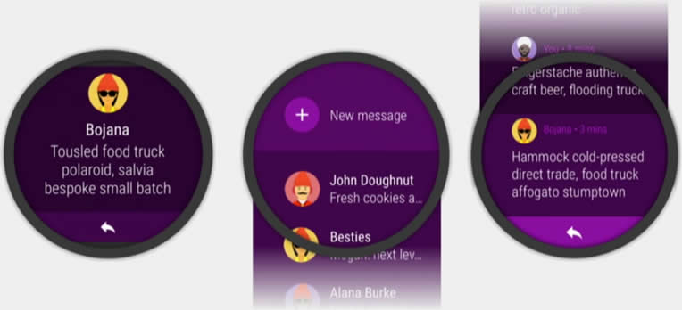

# Material Color Generator

This is a small tool which should you help to select the right colors for your project. If you like this tool please star it.

You can specify your main color and you will get the matching colors for UI Elements as described in the
[Building Apps with Material Design](https://youtu.be/LtD7eJp2ILo?t=6m1s) talk about Wear 2.0 on the Google
I/O 2016.

Basically the colors are calculated based on the [HSB or HSV](https://en.wikipedia.org/wiki/HSL_and_HSV)
color space. Here is a screenshot taken from the Video above:

If you like to play around with this code just open [index.html](https://rekire.github.io/MaterialColorGenerator/).

## Used third party libs
A light modified [color convertation][1] implementation from [mjackson](https://github.com/mjackson).

## License
This code is licensed under the [Rekisoft Public License](http://www.rekisoft.eu/licenses/rkspl.html).  
There is no need for contibution for using the generated colors.

  [1]: https://github.com/mjackson/mjijackson.github.com/blob/master/2008/02/rgb-to-hsl-and-rgb-to-hsv-color-model-conversion-algorithms-in-javascript.html